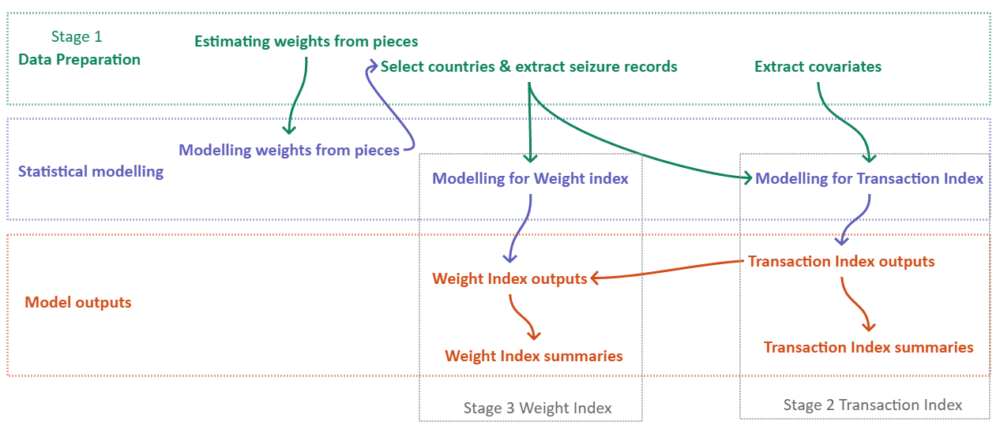

# ETIS_CITESReporting_RCode  

R scripts for analysis of ETIS data for reporting to CITES

This repository contains the R scripts used to analyse data from the Elephant Trade Information System (ETIS) to produce outputs for reports to the Convention for International Trade in Endangered Species of Wild Fauna and Flora (CITES) 

## Background

ETIS, managed by TRAFFIC International,  was originally mandated by CITES to track levels and trends in the illegal trade in elephant ivory and other elephant products under CITES resolution Conf. 10.10 to inform decision making on elephants. 
ETIS comprises reported records of seizures and subsidiary data on covariates related to the illegal ivory trade. ETIS is required to produce reports to CITES Standing Committees and CoPs. 

## Version v.CoP18

Version CoP18 of this repository contains the R scripts used to produce the analysis of the ETIS data for a report – [Milliken et al (2018)](https://cites.org/sites/default/files/eng/cop/18/doc/E-CoP18-069-03-R1.pdf) - to the 18th meeting of the CITES Conference of the Parties (CoP18).  

The pdf [Notes_CoP18.pdf](Notes_CoP18.pdf) contains detailed notes on how the R scripts combine together for this analysis and more detailed versions of the sections in this file and the other .md files in this repository.

## Methodological Notes

The underlying methodology used for analysis is described in the Technical Report - [Burn & Underwood (2013)](http://www.reading.ac.uk/web/FILES/maths/Burn_Underwood_Technical_Report_Modelling_the_illegal_ivory_trade.pdf). The modelling framework and detailed results are also described in the peer-reviewed paper [Underwood et al. (2013)](http://www.plosone.org/article/info%3Adoi%2F10.1371%2Fjournal.pone.0076539). Results from using this methodology were first presented in a CITES report at CoP16 – [Milliken et al. (2013)](http://www.plosone.org/article/info%3Adoi%2F10.1371%2Fjournal.pone.0076539).

Some revisions to the methodology have occurred since 2013. These have generally been documented in the relevant reports to CITES Standing Committees and CoPs and in CITES Information Documents in response to interventions by CITES Parties. The key methodological changes are:

*	The model to estimate seizure weights from number of pieces no longer includes a time trend (change first included in analysis for SC66)
*	The model to estimate the weight per seizure (for raw or worked ivory) no longer includes a time trend (CoP17) 
*	Revised criterion to select the countries to include in the analysis (CoP17)
*	Derivation of a new variable – the Trade Chain Index – for consideration as a proxy variable for the seizure rate (CoP18) 
*	Five rather than six ivory classes are used to model the Transaction Index (CoP17)
*	Accounting for multiple countries of origin (CoP17)
*	A revised set of variables for use in the cluster analysis (CoP18)
*	Development of a methodology to explore the robustness of the cluster analysis (CoP18)
*	Bayesian modelling is carried out using JAGS rather than WinBUGS (CoP17)

Basic definitions are described in [DataDefinitions](DataDefinitions.md)

## Analysis
There are four principle stages comprising an analysis of the ETIS data for a CoP report. Those stages are:

1.	Preparing the  data for analysis
2.	Deriving the Transaction Index (TI) to produce smoothed relative trends in illegal ivory trade transactions
3.	Deriving the Weight Index (WI) to produce smoothed relative trends in the quantitye of illegal ivory in trade
4.	Undertaking a cluster analysis to comparatively assess the role of countries in the illegal ivory trade for a specific time period. 

The work in each of these stages consists of a series of steps that can be generically described as data preparation, statistical modelling and the production of model outputs. The figure below shows the main steps in each of the first three stages and how they link together.  The document [Notes_CoP18.pdf](Notes_CoP18.pdf) describes how different R scripts fit together.

## A note on the R scripts

The R scripts for the ETIS analysis in the directory [R](https://github.com/fmunderwood/ETIS_CITESReporting_RCode/tree/master/R) were originally developed under [Darwin Initiative project 17-020](http://www.darwininitiative.org.uk/project/17020/) over the period 2009 – 2013. Those R scripts were written by RW Burn and FM Underwood. Since then, the ETIS analysis has been revised, as described above, and the R code improved and updated.

Because of the nature of ETIS funding, all improvements to date have been made within an analysis cycle. Thus the R code has been adapted iteratively over time.  All attempts are made to update files in a consistent manner but some inconsistencies between files remain – for example in some files weights are identified as wts and other times wgts. 

## References

Burn RW, Underwood FM (2013) A new statistical modelling framework to interpret ivory seizures data: A Technical Report describing the new modelling framework for analysing seizures data from the Elephant Trade Information System. Mathematics Report series ([1/2013](http://www.reading.ac.uk/web/FILES/maths/Burn_Underwood_Technical_Report_Modelling_the_illegal_ivory_trade.pdf)) Department of Mathematics and Statistics, University of Reading, UK

Milliken T, Underwood FM, Burn RW, Sangalakula L (2018). The Elephant Trade Information System (ETIS) and the Illicit Trade in Ivory: A report to the 18th meeting of the Conference of the Parties to CITES. CITES Secretariat, Geneva, Switzerland. [CoP18 Doc. 69.3 Annex 1](https://cites.org/sites/default/files/eng/cop/18/doc/E-CoP18-069-03.pdf)

Milliken T, Burn RW, Underwood FM, Sangalakula L (2013) Monitoring the illegal trade in ivory and other elephant specimens. Proceedings of the Conference of the Parties 16, CITES (UNEP) COP16 [CoP16 Doc 53.2.2 (Rev.1)](https://www.cites.org/sites/default/files/eng/cop/16/doc/E-CoP16-53-02-02.pdf) 

Milliken, T., Burn, R.W. and Sangalakula, L. (2002). A report on the status of the Elephant Trade Information System (ETIS) to the 12th meeting of the Conference of the Parties.  CoP12 Doc. 34.1 Annexe 1. CITES Secretariat, Geneva, Switzerland

Underwood FM, Burn RW, Milliken T (2013) Dissecting the illegal ivory trade: an analysis of ivory seizures data. PLoS One 8(10): e76539. [doi:10.1371/journal.pone.0076539](http://www.plosone.org/article/info%3Adoi%2F10.1371%2Fjournal.pone.0076539)

